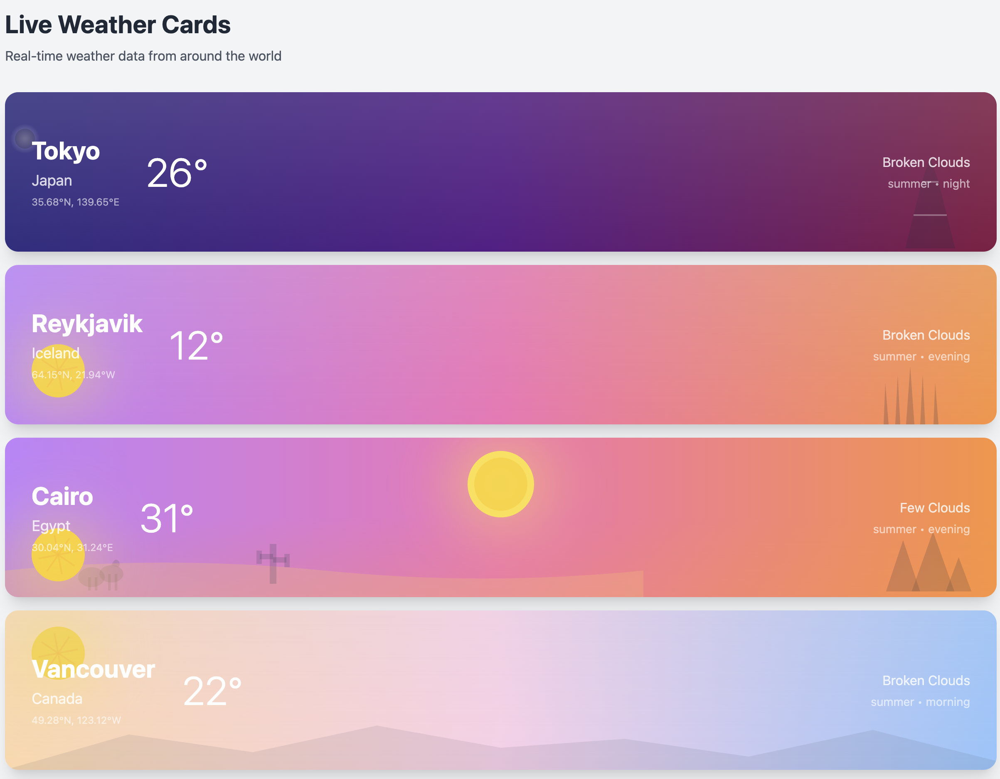

# Weather Cards

A visual exploration of weather data through rich, gestalt infographics.



🌍 **[View Live Demo](https://anselm.github.io/weathercards)**

## The Power of Visual Synthesis

In our pursuit of clean, minimalist interfaces, we often forget a fundamental truth about human cognition: our minds are extraordinarily adept at processing rich, complex visual information. Just as we appreciate the layered complexity of a symphony or the nuanced prose of great literature, our visual cortex craves—and excels at parsing—dense, multifaceted imagery.

This project explores the utility of infographics that synthesize multiple data streams into cohesive visual experiences. By combining weather conditions, time of day, seasonal changes, celestial positions, and location-specific elements into unified "weather cards," we create a gestalt understanding that transcends the sum of its parts.

### Why Rich Interfaces Matter

Modern design philosophy often champions minimalism—clean lines, ample whitespace, reduced cognitive load. While these principles have their place, they can sometimes strip away the very richness that makes information memorable and emotionally resonant. Consider:

- **Pattern Recognition**: Humans evolved to quickly parse complex natural environments. A forest scene contains thousands of visual elements, yet we effortlessly extract meaning.
- **Emotional Connection**: Rich visuals engage our aesthetic senses, creating memorable experiences that pure data cannot match.
- **Contextual Understanding**: Multiple visual layers provide context that helps us understand relationships between different data points intuitively.
- **Cultural Resonance**: Location-specific visual elements (cherry blossoms in Tokyo, northern lights in Reykjavik) create immediate cultural and geographical context.

## About This Project

Weather Cards demonstrates how we might move beyond sterile data displays toward interfaces that embrace visual complexity while maintaining clarity of purpose. Each card represents a city's current weather conditions through:

- Dynamic backgrounds reflecting time of day
- Weather effects (rain, snow, storms)
- Sun and moon positions based on actual astronomical data
- Seasonal elements (falling leaves, cherry blossoms)
- Iconic landmarks as subtle silhouettes
- Regional flora and fauna
- Real-time temperature and conditions

## Technical Implementation

Built with:
- React + Vite for fast development
- Tailwind CSS for styling
- OpenWeather API for real-time data
- SVG graphics for scalable visual elements
- CSS animations for dynamic effects

## Running Locally

```bash
# Clone the repository
git clone https://github.com/anselm/weathercards.git
cd weathercards

# Install dependencies
npm install

# Add your OpenWeather API key to .env
echo "VITE_OPENWEATHER_API_KEY=your_api_key_here" > .env

# Start development server
npm run dev
```

## Design Philosophy

This project suggests that there's room in our design thinking for interfaces that:

1. **Embrace Complexity**: Not everything needs to be minimalist. Sometimes richness serves the user better.
2. **Trust Human Perception**: We're capable of processing far more visual information than we often give ourselves credit for.
3. **Create Emotional Experiences**: Data doesn't have to be dry. It can be beautiful, evocative, and memorable.
4. **Synthesize Multiple Inputs**: The most useful visualizations often combine many data sources into coherent wholes.

As we continue to evolve human-computer interfaces, perhaps it's time to reconsider our relationship with visual complexity. Just as we wouldn't want all music to be simple melodies or all writing to be basic sentences, our visual interfaces can benefit from the kind of richness that engages both our analytical and aesthetic faculties.

## Contributing

This is an exploration in progress. Contributions, ideas, and discussions about rich interface design are welcome.

## License

MIT License - feel free to use this code in your own explorations of visual interface design.
